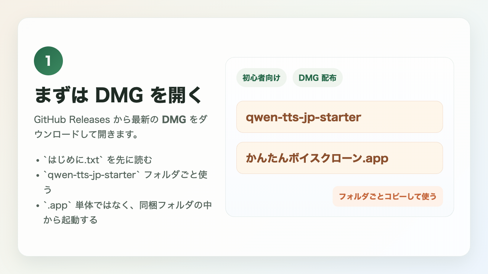
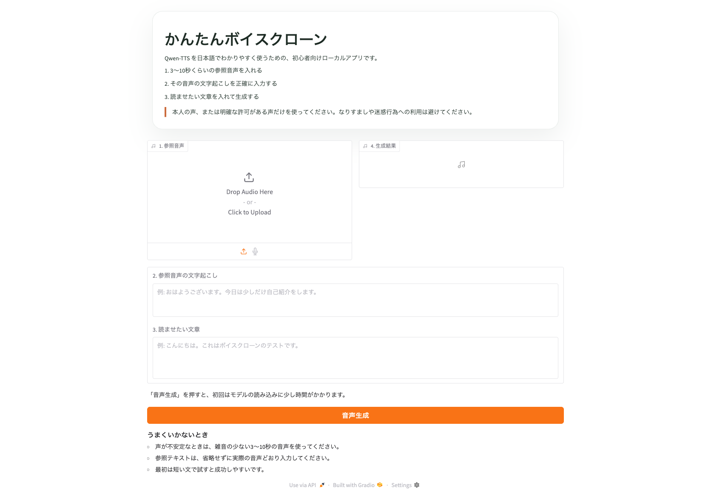

# qwen-tts-jp-starter

`Qwen-TTS` を、日本語でわかりやすく始めるための初心者向けスターターです。  
Apple Silicon の Mac で、できるだけ迷わずボイスクローンを試せることを目的にしています。

**最新の配布版:** [DMG をダウンロード](https://github.com/kantaro4123/qwen-tts-jp-starter/releases/latest/download/qwen-tts-jp-starter-macos.dmg)
  
いちばん簡単なのは `DMG` 版です。こちらは **Python を先に入れなくても動く、内蔵ランタイム付き `.app`** として配布しています。




## できること

- 参照音声をアップロードして、声の雰囲気をまねた音声を作る
- 参照動画をアップロードして、音声だけ自動で取り出す
- 開始秒・終了秒を指定して、参照素材を切り出す
- 前後の無音を自動でカットする
- 参照素材の長さや無音を簡単にチェックする
- 例文ボタンで入力のたたき台をすぐ入れられる
- 読ませる言語を選べる
- 参照音声の自動文字起こしを使える
- 日本語UIで手順を見ながら試せる
- ローカルで動かせる

このアプリは、参照音声の話者にできるだけ寄せることを目指しています。  
ただし、完全に同じ声になる保証はなく、条件によっては別人っぽい声になることがあります。

## 対応環境

- macOS
- Apple Silicon の Mac
- Python 3.9 以上

推奨は `Python 3.12` です。  
これは **ソース版をターミナルから使う場合** の条件です。  
DMG 版の `.app` は Python を内蔵しているので、通常は別途 Python を入れなくても使えます。

最初の公開版では、初心者向けに対象を絞っています。  
Windows 対応や多機能化は、動作のわかりやすさを優先していったん外しています。

## 推奨スペック

- Apple Silicon の Mac
- メモリ 16GB 以上推奨
- できれば空きストレージ 15GB 以上

目安:

- `16GB` メモリ: まず快適に試しやすいライン
- `8GB` メモリ: 動く可能性はありますが、かなり重くなったり不安定になりやすいです
- VRAM というより、Apple Silicon では共有メモリの余裕が重要です

## まず最初にやること

このアプリは、最初にこのリポジトリのファイル一式を Mac に入れてから使います。  
そのあとで `setup.command` を実行して、必要なものを自動でインストールします。

`cd qwen-tts-jp-starter` は「インストール」ではなく、`qwen-tts-jp-starter` というフォルダに入るためのコマンドです。

### Python についての簡単な補足

この項目は **ソース版を使う場合** の説明です。DMG 版の `.app` を使うだけなら、ここは気にしなくて大丈夫です。

- このスターターを使う前に、Mac に `Python` を入れておく必要があります
- 難しく見えるかもしれませんが、ここでは「このアプリを動かすための土台」くらいに考えて大丈夫です
- 対応は `Python 3.9 以上`、おすすめは `Python 3.12` です
- 入っているか確認するには、ターミナルで次を実行します

```bash
python3 --version
```

`Python 3.9` 以上と表示されれば使えます。  
入っていない場合は、[python.org の macOS 向けダウンロードページ](https://www.python.org/downloads/macos/) から入れてください。

## いちばん簡単な始め方

### 方法A: GitHub から ZIP をダウンロードする

1. このページを開きます  
   [https://github.com/kantaro4123/qwen-tts-jp-starter](https://github.com/kantaro4123/qwen-tts-jp-starter)
2. 緑色の `Code` ボタンを押します
3. `Download ZIP` を押します
4. ダウンロードした ZIP ファイルをダブルクリックして展開します
5. 展開してできた `qwen-tts-jp-starter` フォルダを開きます
6. `setup.command` をダブルクリックします
7. セットアップが終わったら `run.command` をダブルクリックします

`setup.command` と `run.command` を直接使う方法では、通常はブラウザが自動で開きます。開かない場合だけ [http://127.0.0.1:7860](http://127.0.0.1:7860) を開いてください。

### 方法A-2: いちばん簡単な DMG 版を使う

1. [最新の DMG をダウンロード](https://github.com/kantaro4123/qwen-tts-jp-starter/releases/latest/download/qwen-tts-jp-starter-macos.dmg) します
2. ダウンロードした `qwen-tts-jp-starter-macos.dmg` をダブルクリックします
3. 開いたウィンドウの `はじめに.txt` を先に読みます
4. `かんたんボイスクローン.app` を `Applications` にドラッグします
5. `Applications` から `かんたんボイスクローン.app` を開きます
6. 最初だけアプリ内の `初回セットアップ` を押します
7. 準備が終わったら、同じアプリ画面の `起動` を押します

この方法だと、ターミナルでコマンドを打たずに始めやすく、起動後もブラウザではなくアプリ内で使えます。  
さらに、DMG 版は Python や `qwen-tts` の実行環境をアプリ内に同梱しています。

初回セットアップの前に、アプリ上部で次も選べます。

- `Qwen-TTS モデル`: `高精度 1.7B` / `軽量 0.6B`
- `ローカルASR モデル`: `small` / `base` / `medium`

標準は `高精度 1.7B` です。軽さを優先したい場合だけ `0.6B` を使ってください。  
この選択は、以後の起動でも引き継がれます。

動画から音声を取り出したい場合は、`ffmpeg` が入っていると便利です。  
Homebrew を使うなら次で入れられます。

```bash
brew install ffmpeg
```

ローカル文字起こしも使いたい場合は、あとから次も実行できます。

```bash
./install_local_asr.command
```

### 方法B: ターミナルでダウンロードする

ターミナルを開いて、上から順番にそのまま実行してください。

```bash
git clone https://github.com/kantaro4123/qwen-tts-jp-starter.git
cd qwen-tts-jp-starter
chmod +x setup.command run.command
./setup.command
./run.command
```

それぞれの意味:

- `git clone ...` は GitHub からファイル一式をダウンロードします
- `cd qwen-tts-jp-starter` は、そのフォルダの中に移動します
- `chmod +x ...` は、起動用ファイルを実行できる状態にします
- `./setup.command` は、必要なライブラリをインストールします
- `./run.command` は、アプリを起動します

## ターミナルで細かく始める手順

### 1. ターミナルを開く

`アプリケーション` → `ユーティリティ` → `ターミナル` から開けます。

### 2. GitHub からファイルをダウンロードする

```bash
git clone https://github.com/kantaro4123/qwen-tts-jp-starter.git
```

### 3. ダウンロードしたフォルダに移動する

```bash
cd qwen-tts-jp-starter
```

### 4. 実行できるようにする

```bash
chmod +x setup.command run.command
```

### 5. セットアップする

Finder から `setup.command` をダブルクリックするか、ターミナルで次を実行します。

```bash
./setup.command
```

初回は少し時間がかかります。  
これは必要なライブラリやモデルの準備をしているためです。

### 6. アプリを起動する

Finder から `run.command` をダブルクリックするか、ターミナルで次を実行します。

```bash
./run.command
```

通常はブラウザが自動で開きます。開かない場合は [http://127.0.0.1:7860](http://127.0.0.1:7860) を開いてください。

### 7. 終わるとき

ターミナルで `Ctrl + C` を押すと停止できます。

## 次回以降の起動方法

最初のセットアップが終わっていれば、2回目以降は毎回 `setup.command` を実行する必要はありません。  
次回からは `run.command` だけで起動できます。

### Finder から起動する

1. `qwen-tts-jp-starter` フォルダを開きます
2. `run.command` をダブルクリックします

### ターミナルから起動する

```bash
cd qwen-tts-jp-starter
./run.command
```

通常はブラウザが自動で開きます。  
ターミナルから起動した場合は、終わるときに `Ctrl + C` を押してください。

`.app` を使う場合は、アプリの中に `起動 / 初回セットアップ / 更新 / ローカル文字起こしを追加 / READMEを開く` のボタンが並びます。
.app 上部には `Qwen-TTS モデル` と `ローカルASR モデル` の選択欄もあります。
ローカル文字起こしだけあとから追加したいときは、`.app` の `ローカル文字起こしを追加` を使えます。
起動後はブラウザではなく、アプリ内の画面でそのまま使えるようにしています。

## DMG 版の使い方

`dmg` 版を配布するときは、中に `はじめに.txt` を入れています。

1. `かんたんボイスクローン.app` を `Applications` にドラッグします
2. `Applications` から `かんたんボイスクローン.app` を開きます
3. 最初はアプリ内の `初回セットアップ` を押します
4. 使うときはアプリ内の `起動` を押します

この `.app` は、Python と実行環境をアプリ内に同梱した standalone 版です。  
そのため、外部の Python や外部の `qwen-tts` がなくても動かせる想定です。

### Apple Developer に加入していなくても使える？

はい、使えます。  
ただし、現時点の公開版は **未署名 / 未公証でも配れる前提** なので、初回起動時に macOS の警告が出ることがあります。

最初に警告が出たら、この順番で進めてください。

1. アプリを `右クリック`
2. `開く` を選ぶ
3. 確認ダイアログでもう一度 `開く` を選ぶ

それでも開けない場合は、`システム設定 > プライバシーとセキュリティ` にある `このまま開く` を使ってください。

### 既に Python や qwen-tts が入っている場合

- DMG 版の `.app` は、基本的に **アプリ内に同梱した Python / qwen-tts 環境** を使います
- そのため、すでに Mac に別の Python や `qwen-tts` が入っていても、通常はそれらを直接使いません
- 既存の環境を壊しにくい代わりに、アプリの中で独立して動きます
- ただし、モデルのキャッシュが `Hugging Face` 側に既にある場合は、再ダウンロードを避けられることがあります

### モデル同梱について

- 配布用ビルド時に、任意の `Qwen-TTS` モデルを `.app` に同梱できるようにしています
- モデルを同梱した場合は、初回セットアップ時にそのモデルも一緒に展開されます
- その場合、初回生成時のダウンロード待ちをかなり減らせます
- 手順は [docs/signing-notarization.md](docs/signing-notarization.md) の `モデル同梱つきビルド` を見てください

## 使い方

1. `参照音声` または `参考用の動画でもOK` に素材を入れます。
2. 必要なら `切り出し開始秒` と `切り出し終了秒` を入れます。`0` のままなら、最初から最後まで使います。
3. `前後の無音を自動でカット` を必要に応じて使います。
4. 先に `参照素材を整える` を押すと、切り出した結果を `整えた参照音声` で確認できます。
5. 必要なら `参照音声を自動文字起こし` を押して、参照テキストの下書きを入れます。
6. `参照音声の文字起こし` に、その音声で実際に話している内容を正確に入れます。
7. `読ませたい文章` に、生成したい文章を入れます。
8. `読ませる言語` を選びます。
9. `音声生成` を押します。
10. 生成したファイルを見たいときは `出力フォルダを開く` を押します。

## きれいに作るコツ

- 参照音声は 3 秒以上あるものを使う
- 精度を上げたいなら、30 秒前後のきれいな音声も有効
- 無音やBGMが少ない音声を使う
- 参照音声は1人だけが話しているものにする
- 参照テキストは省略せず、実際の発話どおりに書く
- 最初は短い文章で試す
- 参照音声と参照テキストが少しでもズレると、別人っぽい声になりやすい
- `参照素材を整える` のチェック結果も参考にする
- このアプリは参照素材を保存前に `モノラル化 + 24kHz化 + 軽い音量調整` して、ばらつきを減らしています

## 対応言語

- `Auto`
- `Chinese`
- `English`
- `German`
- `Italian`
- `Portuguese`
- `Spanish`
- `Japanese`
- `Korean`
- `French`
- `Russian`

日本語UIですが、生成音声は多言語に対応しています。  
まずは `読ませる言語` を、読ませたい文章に合わせて選んでください。

## 重くしすぎずに再現性を上げるコツ

- まずはモデルを重くするより、参照素材を整える方が効果的です
- 1人だけが、はっきり、一定の音量で話している素材を使う
- 前後の無音や間を減らす
- 参照テキストは一字一句合わせる
- 最初は短文で声質を確認して、問題なければ少しずつ長くする
- 雑音除去や極端な加工をかけすぎるより、素直な録音の方が安定しやすいです
- `参照音声を自動文字起こし` を使っても、そのまま信用せず最後に目で確認してください

## 参照音声の対応形式

- 主に `wav`、`mp3`、`m4a`、`flac`、`ogg` などの一般的な音声ファイルを想定しています
- いちばんおすすめは `wav` です
- うまく読めないときは、`wav` に変換してから試してください
- 録音ボタンでそのままマイク録音した音声も使えます

## 参照動画の対応形式

- 主に `mp4`、`mov`、`m4v` など、`ffmpeg` で読める一般的な動画ファイルを想定しています
- 動画を入れると、アプリ側で音声だけ取り出して参照音声として使います
- 動画変換でうまくいかない場合は、先に動画から `wav` を書き出して音声として入れるのが安全です

## よくあるつまずき

### 初回起動が遅い

初回はモデルのダウンロードが入るので時間がかかります。  
2回目以降は速くなります。

### 「開発元を確認できません」と出る

Apple Developer の署名・公証なしでも配布できるようにしているため、最初の起動時に macOS の警告が出ることがあります。

対処:

1. アプリを `右クリック`
2. `開く` を選ぶ
3. 確認ダイアログでもう一度 `開く` を選ぶ

それでも出る場合は、`システム設定 > プライバシーとセキュリティ` にある `このまま開く` を使ってください。

### うまく起動しない

- `python3` が 3.9 以上か確認してください
- できれば `python3.12` を使ってください
- Apple Silicon の Mac か確認してください
- 依存関係が壊れた場合は、`.venv` を削除して `./setup.command` をやり直してください
- `git: command not found` と出る場合は、まず Xcode Command Line Tools を入れてください
- 動画変換で失敗する場合は、`ffmpeg` が入っているか確認してください

```bash
python3 --version
xcode-select --install
ffmpeg -version
```

### 声が別人っぽくなる

- 参照音声が短すぎる、雑音が多い、複数人が入っている、という条件だと起こりやすいです
- 参照テキストが少しでも違うと、話者の再現性がかなり落ちます
- まずは 10 秒前後、その次に 20〜30 秒前後のきれいな音声で試してください
- 参照素材を整えたあと、短文で一度声質確認してから本番の文章を入れるのが安全です

## 公開・改造のヒント

- GitHub で公開するときは、トップにスクリーンショットを載せると伝わりやすいです
- `app.py` の文言を変えるだけでも、日本語UIはかなり調整できます
- `QWEN_TTS_MODEL_ID` 環境変数で別モデルに差し替えられます

## macOS アプリ化 / DMG 化

このリポジトリには、macOS 向けの WebView ラッパー `.app` と `.dmg` を作るための下地も入っています。

```bash
./scripts/build_launcher_app.sh
./scripts/build_dmg.sh
```

詳しくは [docs/dmg-packaging.md](docs/dmg-packaging.md) を見てください。
署名・公証・モデル同梱ビルドまで進めたい場合は [docs/signing-notarization.md](docs/signing-notarization.md) を見てください。

## 自動文字起こしについて

- `参照音声を自動文字起こし` はオプション機能です
- 利用には `OPENAI_API_KEY` が必要です
- API キーがない場合でも、アプリ本体の音声生成はそのまま使えます
- ローカルで使いたい場合は `./install_local_asr.command` を実行すると `faster-whisper` を追加できます
- アプリ内では `自動選択 / OpenAI API / ローカル faster-whisper` を切り替えられます
- ローカル faster-whisper のモデルサイズは、あとからアプリ内の `設定` で `base / small / medium` を切り替えられます

## モデル設定について

- `Qwen-TTS` は `高精度 1.7B / 軽量 0.6B` を選べます
- `faster-whisper` は `small / base / medium` を選べます
- 標準は `高精度 1.7B` です
- DMG 版では、アプリ上部の選択欄で変更できます
- ソース版では、Web UI 内の `設定` でも変更できます
- `Qwen-TTS` を変更した場合は、次の起動や次の生成から反映されます

## オープンソースASR候補

`ASR` は音声認識のことです。  
このプロジェクトで組み込みやすい候補は、今のところ次の順番です。

1. `faster-whisper`
2. `openai/whisper`
3. `FunASR`

このスターターでは、まず `faster-whisper` をローカル文字起こし候補として採用しています。  
理由は、精度と導入のしやすさのバランスが良く、アプリに組み込みやすいからです。

## GitHub に公開する流れ

```bash
git init
git add .
git commit -m "Initial commit"
gh repo create qwen-tts-jp-starter --public --source=. --remote=origin --push
```

リポジトリ名を変えたい場合は、最後の `qwen-tts-jp-starter` の部分だけ好きな名前に変えてください。

## 注意

本人の声、または明確な許可がある声だけを使ってください。  
なりすまし、詐欺、嫌がらせ、権利侵害につながる使い方は避けてください。
